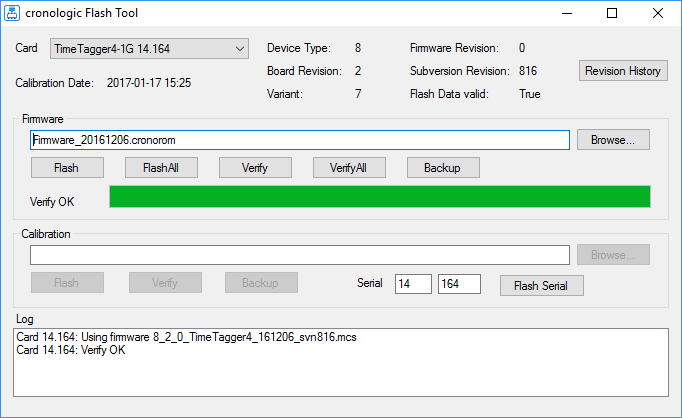

=============
Functionality
=============

The TimeTagger4 is a “classic” common-start time-to-digital converter.

It records the time difference between a leading or trailing edge on the start input
to the leading or trailing edges of the stop inputs (called **timestamps**).

Detection of rising and falling edges of the stop channels A–D can be enabled
individually.

The time measurements are quantized. The quantization depends on the specific variant
of the TimeTagger4, ranging from **100 to 1000 ps** (see :numref:`table variants`).

The timestamps are recorded in integer multiples of the data bin size
(500 ps for Gen 1 and **100 ps** for Gen 2).

Throughout this User Guide, transitions of the input signals are called **hits**.

To reliably detect hits, the signal has to be stable for more than one quantization
interval before and after the edge.

Triggers on the Start channel must not occur less than **5 ns** apart.

The TimeTagger4 records events without dead time at a readout rate
of about 48 MHits/s for Gen 1 and **60 MHits/s** for Gen 2. For Gen 2, the maximum
readout rate of a single channel is **40 MHits/s**.

.. _sec grouping:

Grouping and Events
===================

In typical applications, a start hit is followed by a multitude of stop hits.

The TimeTagger4 manages hits in groups (in some applications, a group of hits is
often called an “event”).

.. figure:: _figures/grouping.*
    :name: fig grouping
    :alt: Grouping principle of the TimeTagger4

    Principle of the grouping functionality.
    Only the orange hits where the leading edge falls in-between *start* and *stop* are
    grouped, others discarded. Alternatively, trailing edges or both edges may be used
    to determine if a hit should be kept.

:numref:`fig grouping` shows a corresponding timing diagram. For each Stop channel,
you can define the range within which events are grouped.
Hits outside that range are discarded.

Each Stop channel is configured by setting the
:c:member:`start <timetagger4_channel.start>` and
:c:member:`stop <timetagger4_channel.stop>` values of the corresponding
:c:member:`channel[i] <timetagger4_configuration.channel>`.

If a second start hit is recorded within the range of a group, the current group
is finished and a new group is started. Consecutive stop hits will be assigned
to the new group (as long as they are within the group range).

For Gen 1, the maximum group range is 0 ≤ *start* ≤ *stop* ≤ 2\ :sup:`31`.

For Gen 2, the **maximum group range** is 0 ≤ *start* ≤ *stop* ≤ 2\ :sup:`32`.

*Start* and *stop* are in units of :c:member:`timetagger4_param_info.binsize`
(which is 500 ps for Gen 1 and 100 ps for Gen 2).
Ergo, the maximum group range is 1.073 s for Gen 1 and 0.429 s for Gen 2.

.. note::

    For group ranges *stop* – *start* > 2\ :sup:`24`, the timestamps
    will contain *rollover* (see 
    :c:macro:`TIMETAGGER4_HIT_FLAG_TIME_OVERFLOW <crono_packet.data.TIMETAGGER4_HIT_FLAG_TIME_OVERFLOW>`.)

.. _sec auto trigger:

Auto-Triggering Function Generator
==================================

Some applications require internal periodic or random triggering.
The TimeTagger4 auto trigger function generator provides this functionality.

The delay between two trigger pulses of this trigger generator is the sum of two
components: A fixed value *M* and a pseudo-random value with a range given by the
exponent *N*.

The period is

.. math::

    T = M + [1 \dots 2^N] - 1

clock cycles with a duration of 4 ns per cycle for Gen 1 and 3.2 ns for Gen 2
TimeTagger4.

The standard values of *M* = 62500 and *N* = 0 result in a frequency of 4 kHz
for TimeTagger4 Gen 1 and 5 kHz for Gen 2.

*M* and *N* are configured with
:c:member:`timetagger4_configuration.auto_trigger_period` and
:c:member:`timetagger4_configuration.auto_trigger_random_exponent`,
respectively. 

The trigger can be used as a source for the TiGer unit [see :ref:`sec tiger`], which
enables internal triggering of the Start channel.

The trigger defines the period for the continuous mode (see :ref:`sec continuous mode`).

.. _sec continuous mode:

Continuous Mode
===============

This feature is only available for TimeTagger4 Gen 2.

In continuous mode, the TimeTagger4 continuously records stop signals even without a
start signal.

The data stream contains periodic packets with an absolute 64-bit timestamp, followed
by a list of stop timestamps relative to the absolute one.

The frequency of absolute timestamps can be adjusted using the
:ref:`Auto-Triggering Function Generator <sec auto trigger>`.

Lower frequencies will create larger packets and have a larger latency for
receiving packets. This potentially overflows the
:ref:`buffers <sec memory management>`.

Frequencies lower or equal to 600 Hz will contain rollover
(see :c:macro:`TIMETAGGER4_HIT_FLAG_TIME_OVERFLOW <crono_packet.data.TIMETAGGER4_HIT_FLAG_TIME_OVERFLOW>`).

Disregarding these points, the choice of frequency is arbitrary.

.. _sec input delay:

Configurable Input Delay
========================

This feature is only available for TimeTagger4 Gen 2.

Each of the five input channels of the TimeTagger4 can be delayed for up to 204.6 ns
with a 200 ps granularity.

.. _sec tiger:

Timing Generators (TiGer)
=========================

Each digital LEMO-00 input can be used as an LVCMOS trigger output.

The TiGer functionality can be configured for each connector independently.
See :c:struct:`timetagger4_tiger_block` for a full description of all configuration
options.

:numref:`fig tiger matrix` shows how the TiGer blocks are connected. They can be
triggered by an OR of an arbitrary combination of inputs, including the auto trigger.
Each TiGer can drive its output to its corresponding LEMO connector. This turns the
connector into an output.

The TiGer is DC coupled to the connector. Connected hardware must not drive any signals
to connectors that are used as outputs, as doing so could damage both the
TimeTagger4 and the external hardware. Pulses that are short enough for the input
AC coupling are available as input signals to the TimeTagger4. This can be used to measure
exact time differences between the generated output signals and input signals
on other channels.

When using one of the input channels as a source for the TiGer, the expected latency between
signal input and TiGer output is roughly 9 5ns.

.. figure:: _figures/xTDC4_tiger_matrix.*
    :name: fig tiger matrix
    :alt: Routing logic of the TiGer blocks of the TimeTagger4
    :width: 95%

    Routing logic of the TiGer blocks. The LEMO inputs can trigger the TiGer blocks,
    which can enable outputs on the LEMO connectors.

Performing a Firmware Update
============================

    Screenshot of the TimeTagger4's FirmwareGUI.

After installing the TimeTagger4 device driver, a firmware update tool is available.
By choosing *FirmwareGUI.exe* a firmware update can be performed
(the default location is under ``C:\Program Files\cronologic\TimeTagger4\apps\x64\``)
After invoking the
application, a window as shown in :numref:`fig flashtool` will appear. 
The tool can be used for updating the firmware and to create a backup of the on-board
calibration data of the TimeTagger4 unit. 

If several boards are present, the one which is going to be used can be selected in
the upper left corner of the window. 

When pressing one of the *Backup* buttons, a backup of the firmware or the calibration
data will be created, respectively. 

In order to perform a firmware update, chose the ``.cronorom``-file to be used by
pressing *Browse*. 
The file contains the firmware data. By pressing *Flash*, the firmware is written
to the board. 

*Verify* can be used to compare the firmware data stored on the TimeTagger4 to the one
provided by a file.

*Flash All* and *Verify All* perform the corresponding operation on all boards which
are installed.

.. attention::

    The new firmware will only be used by the board after a power cycle, i.e.
    after switching the PC (or Ndigo crate) off and back on. 

    A simple reboot is not sufficient. Therefore, the information shown in the
    upper half of the application window does not change right after flashing
    a new firmware.

.. note::

    After a firmware update, the TimeTagger4-10G (and only the 10G variant)
    must be re-calibrated.

.. _sec calibration:

Calibration of the 10G variant
==============================

After performing a firmware update, the TimeTagger-10G variant has to be re-calibrated.
This does *only* apply to the 10G variant.

For this purpose, cronologic provides the ``timetagger4_10g_calibration`` command-line
tool The tool is located in the driver installation directory in ``apps\x64``
(by default
``C:\Program Files\cronologic\TimeTagger4\apps\x64\timetagger4_10g_calibration_64.exe``
).

To perform a calibration, you need a NIM signal with a constant frequency larger than
20 kHz and smaller than 15 MHz. The stability of the frequency is crucial. A period
stability of 6 ps has been verified to work.

Run ``timetagger4_10g_calibration_64.exe`` and follow the instructions on-screen,
that is:

- Connect the NIM signal to the Start channel and press enter. The tool will calibrate 
  the start channel.
- After Start was successfully calibrated, connect the same NIM signal to channel A and
  press enter. The tool will calibrate channel A.
- Repeat the last step for channels B, C, and D.

After a successful calibration of the TimeTagger4-10G, the message
“Calibrated all channels successfully” will be displayed. You can close the
calibration tool.

In case the calibration fails, please check the following:

- The TimeTagger4-10G is installed properly (see :ref:`sec installation`).
- A proper NIM signal with a constant frequency larger than 20 kHz and smaller than
  10 MHz is used.
- The NIM signal used conforms to the signal requirements laid out in
  :ref:`sec tdc inputs`.
- The NIM signal was connected to the appropriate input channel
  (see :numref:`fig bracket`).
